::: {align="center"}
# MESP Health Monitoring Platform

### From wearable sensor bytes to a real-time physiological monitoring console.

```{=html}
<p>
```
``{=html}
``{=html}
``{=html}
``{=html}
``{=html}
``{=html}
``{=html}
```{=html}
</p>
```
```{=html}
<p>
```
`<strong>`{=html}ECG · PPG · IMU · BLE · Streaming Ingest · DSP · Event
Detection · Time-Series Storage · Replay · Real-Time
Visualization`</strong>`{=html}
```{=html}
</p>
```
```{=html}
<p>
```
`<a href="#-system-architecture">`{=html}Architecture`</a>`{=html} ·
`<a href="#-protocol-engineering">`{=html}Protocol`</a>`{=html} ·
`<a href="#-signal-processing">`{=html}DSP`</a>`{=html} ·
`<a href="#-correctness--testing">`{=html}Testing`</a>`{=html} ·
`<a href="#-performance">`{=html}Performance`</a>`{=html} ·
`<a href="#-security--privacy">`{=html}Security`</a>`{=html} ·
`<a href="#-real-hardware">`{=html}Hardware`</a>`{=html}
```{=html}
</p>
```
:::

> **Engineering/research prototype --- not a medical device.**
>
> MESP does not provide medical diagnosis. Physiological values and
> alerts must not be treated as clinically validated measurements or
> used as a substitute for professional medical evaluation.

------------------------------------------------------------------------

## ✦ What is MESP?

MESP is the software platform behind a wrist-worn multi-parameter
health-monitoring prototype.

The wearable acquires:

-   **ECG** from an AD8232
-   **PPG** from a MAX30102
-   **6-axis motion** from an MPU-6886

on an **STM32G431**, then sends framed sensor data through an **nRF52840
BLE bridge**.

This repository takes the system from that raw byte stream all the way
to:

``` text
sensor frames
    ↓
BLE / serial / replay / simulator
    ↓
gateway
    ↓
protocol validation
    ↓
loss + duplicate tracking
    ↓
timestamp reconstruction
    ↓
persistent 1-second chunks
    ↓
signal processing
    ↓
derived estimates
    ↓
event engine
    ↓
live WebSocket
    ↓
React monitoring console
```

The important part is not the dashboard.

**The interesting engineering is everything required to make the
dashboard trustworthy about the data it receives.**

------------------------------------------------------------------------

## 🖥️ Product

```{=html}
<p align="center">
```
``{=html}
```{=html}
</p>
```
The console provides:

-   real-time ECG waveform visualization
-   PPG / pleth visualization
-   accelerometer and gyroscope data
-   derived heart-rate and pulse-rate estimates
-   uncalibrated SpO₂ estimate with motion gating
-   ECG quality / lead-off state
-   activity and orientation
-   heuristic fall events
-   packet-loss and CRC telemetry
-   event acknowledgement
-   historical sensor timelines
-   event click-through to the exact time window
-   CSV / JSON export
-   device pairing
-   sessions and scenarios
-   responsive light/dark UI

Synthetic data is explicitly labelled throughout the UI, sessions,
events, and exports.

```{=html}
<p align="center">
```
``{=html}
``{=html}
```{=html}
</p>
```

------------------------------------------------------------------------

# 🧭 System Architecture

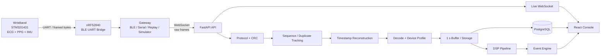

### One code path for hardware and simulation

A core architectural rule is:

> **Hardware, recordings, and simulation must enter the same downstream
> pipeline.**

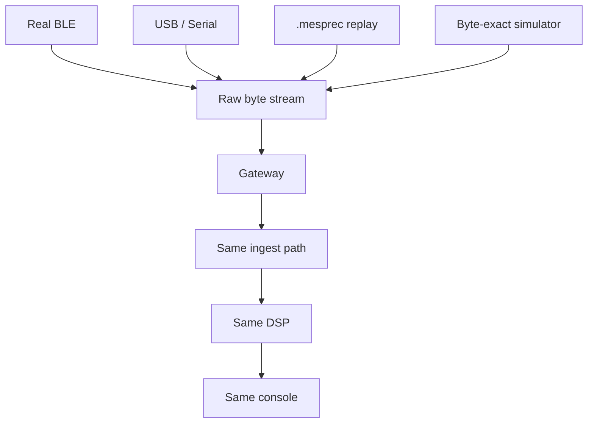

This means a demo is not a separate fake application.

The simulator produces firmware-compatible frames and exercises the same
gateway, ingest, storage, analysis, event, and WebSocket paths used by
real hardware.

------------------------------------------------------------------------

# 🔌 Hardware

The software platform is built around the existing MESP lab hardware.

  -----------------------------------------------------------------------
  Component               Device                  Role
  ----------------------- ----------------------- -----------------------
  MCU                     **STM32G431KB**         acquisition / framing

  ECG                     **AD8232**              single-lead ECG

  PPG                     **MAX30102**            red/IR
                                                  photoplethysmography

  IMU                     **MPU-6886**            acceleration +
                                                  gyroscope

  BLE bridge              **nRF52840 / XIAO**     UART ↔ BLE NUS

  Planned hardware        MAX30205 / MAX17048 /   not present in current
                          SSD1306                 firmware
  -----------------------------------------------------------------------

Current acquisition configuration documented by the firmware includes:

-   ECG: **1 kHz**
-   PPG: **25 Hz effective stream**
-   IMU: **1 kHz**
-   BLE transport through Nordic UART Service

The platform does **not** claim support for hardware that the current
firmware does not transmit.

------------------------------------------------------------------------

# 🧬 Protocol Engineering

One of the strongest parts of the project is that the wire protocol was
**not guessed from documentation**.

The protocol implementation is derived directly from the firmware.

### Link frame

``` text
AA 55
│  │
│  └── sync
└───── sync

version
type
seq
len (LE16)
payload
CRC-16/CCITT-FALSE (LE)
```

Current protocol types include:

``` text
PPG
IMU
STATUS
TEXT
ECG
```

Maximum payload:

``` text
1008 bytes
```

------------------------------------------------------------------------

## 🔬 Firmware-derived golden vectors

The repository contains a host build of the firmware's actual
`nrf_link.c`.

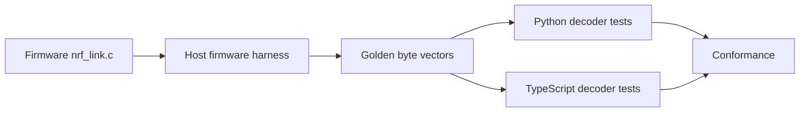

The harness calls the real firmware framing functions and captures the
bytes that would be transmitted over UART.

This resolved details that documentation alone left ambiguous,
including:

-   CRC byte order
-   the sequence counter being shared across frame types

The Python and TypeScript decoders are required to match those vectors
byte-for-byte.

------------------------------------------------------------------------

# 🛡️ Loss, corruption & duplicate handling

A wearable stream cannot simply assume:

> "If bytes arrived, the data is correct."

MESP validates the stream at multiple layers.

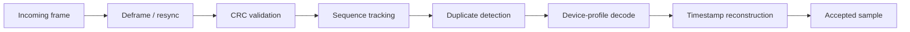

The system tracks:

-   CRC failures
-   sequence gaps
-   duplicates
-   timestamp gaps
-   disconnects
-   stale streams
-   ingest latency

Injected packet loss is counted exactly from sequence gaps in the
simulator tests.

------------------------------------------------------------------------

# ⏱️ The timestamp problem

The device protocol does not provide device timestamps for samples.

That creates a non-obvious systems problem:

> **How do you put a 1 kHz stream on a stable timeline when packets
> arrive over an unreliable link?**

MESP uses a per-stream `StreamClock`.

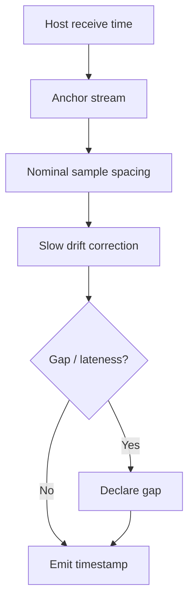

Design constraints:

-   samples are placed at exact nominal spacing
-   host receive time anchors the stream
-   clock drift is corrected slowly
-   data is never moved backwards in time
-   lateness above the documented threshold declares a gap
-   sequence gaps remain separate from timestamp gaps

This is documented in ADR-005 and the timestamp architecture notes.

------------------------------------------------------------------------

# 🧪 Byte-exact simulator & replay

The simulator is not random JSON pretending to be a device.

It produces **firmware-compatible framed bytes**.

Ten deterministic scenarios cover:

``` text
normal
exercise
poor ECG contact
low SpO₂
fall
irregular rhythm
BLE disconnect
low battery
packet corruption
packet loss
```

Recordings use `.mesprec` and can be replayed at different speeds.

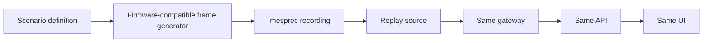

This gives the project:

**determinism + reproducibility + hardware-independent development.**

------------------------------------------------------------------------

# 📡 Gateway

The gateway normalizes multiple input sources behind one asynchronous
interface:

``` text
BleSource
SerialSource
ReplaySource
SimulatorSource
```

Each can emit:

``` text
data
up
down
```

The link state machine tracks:

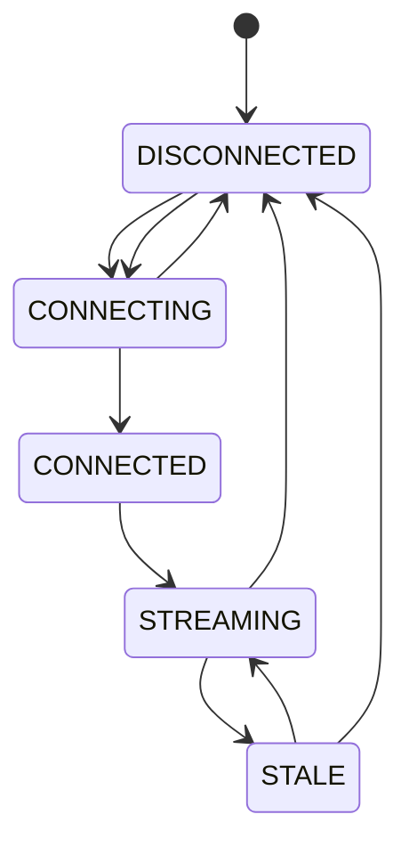

Reconnect uses equal-jitter exponential backoff.

The WebSocket uplink maintains a bounded drop-oldest backlog during API
outages.

A graceful shutdown sends `bye` so normal disconnects are not mistaken
for failures.

------------------------------------------------------------------------

# 🧠 Signal Processing

MESP recomputes derived values server-side rather than trusting
untransmitted firmware debug outputs.

## ECG

Pipeline:

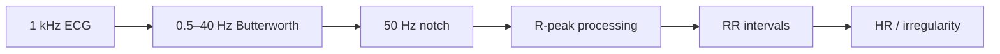

The project uses a Pan-Tompkins-style approach:

-   band-pass filtering
-   derivative
-   squaring
-   moving integration
-   adaptive threshold
-   peak refinement
-   de-duplication across windows

### ECG outputs

-   waveform
-   R-peaks
-   heart rate estimate
-   RR intervals
-   beat-interval irregularity pattern
-   ECG quality
-   lead-off heuristic

HR is withheld when signal quality is insufficient.

------------------------------------------------------------------------

## PPG

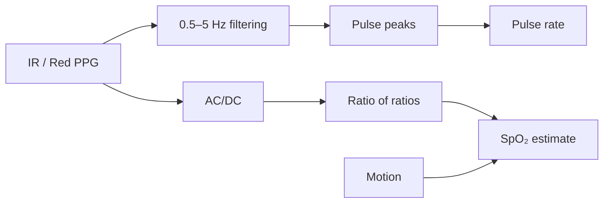

The SpO₂ calculation is explicitly **uncalibrated**.

More importantly, it is motion-gated.

During the exercise scenario, wrist PPG can lock onto arm-swing cadence.
Without motion-artefact cancellation, displaying a confident SpO₂ value
would be more misleading than withholding it.

Therefore:

> **Under sufficient motion or low perfusion, the estimate is
> withheld.**

------------------------------------------------------------------------

## IMU

The platform derives:

-   acceleration magnitude
-   activity level
-   orientation
-   IMU temperature
-   heuristic fall events

The fall heuristic combines:

``` text
free fall
   ↓
impact / saturation
   ↓
stillness
   ↓
orientation change
   ↓
event
```

It is explicitly **not clinically validated**.

------------------------------------------------------------------------

# 🚨 Event Engine

MESP separates **signal processing** from **event policy**.

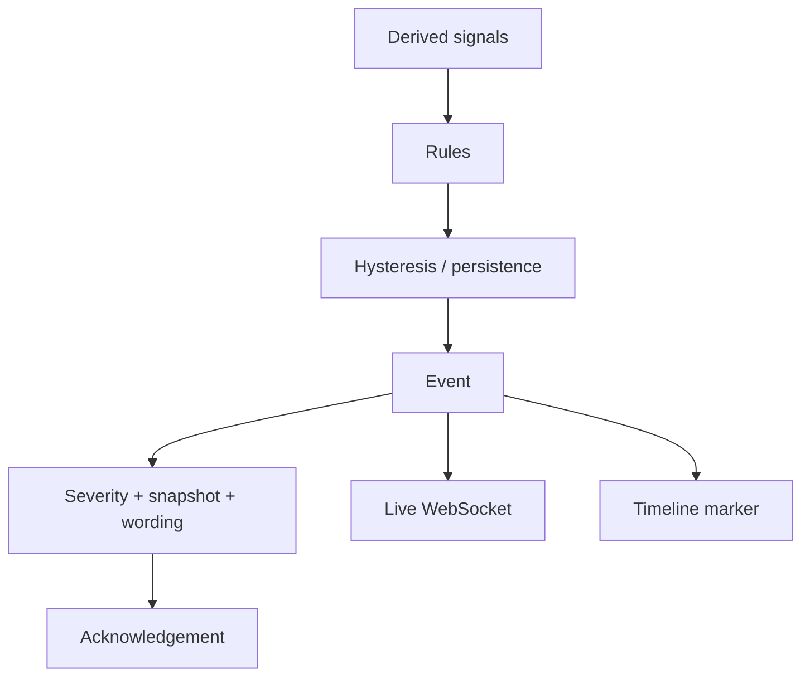

Events include conditions around:

-   heart rate
-   SpO₂ estimate
-   lead-off
-   ECG quality
-   irregular RR patterns
-   battery state
-   packet loss
-   CRC errors
-   falls
-   link transitions

Sustained conditions use hysteresis so a threshold crossing does not
cause alarm flapping.

Every event stores context and can navigate directly to the relevant
point on the historical timeline.

------------------------------------------------------------------------

# 💾 Storage Design

Raw physiological streams are not stored as one database row per sample.

Instead:

``` text
~2,000 raw samples/sec/device
            ↓
       1-second slice
            ↓
   Float32 chunk / stream
            ↓
      PostgreSQL row
```

This reduces raw-sample inserts to approximately:

> **3 rows/device/second**

for the three primary streams.

The design was chosen deliberately instead of introducing TimescaleDB
unnecessarily.

Range queries use min/max envelopes so waveform peaks remain visible
when zoomed out.

Retention is configurable, with raw samples deleted after the configured
retention period.

------------------------------------------------------------------------

# ⚡ Live Console

The browser is designed around high-frequency waveform data without
putting every sample into React state.

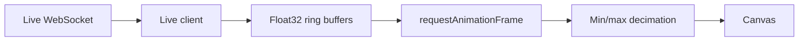

This enables:

-   250 Hz ECG display
-   ring-buffered samples
-   per-pixel min/max decimation
-   gap visualization
-   pause
-   zoom
-   pan
-   fullscreen
-   keyboard control

The UI explicitly models six data states:

``` text
LIVE
STALE
DISCONNECTED
LOADING
ERROR
NO DATA
```

That is preferable to showing stale numbers as though they were current
measurements.

------------------------------------------------------------------------

# 📊 History & analytics

The history interface combines:

-   zoomable timelines
-   sensor envelopes
-   event markers
-   event click-through
-   session analytics
-   ECG vs PPG HR comparison
-   SpO₂ distributions
-   activity/quality breakdown
-   raw-data export

```{=html}
<p align="center">
```
``{=html}
```{=html}
</p>
```

------------------------------------------------------------------------

# 🧪 Correctness & Testing

The project contains **122 automated tests** across protocol,
simulation, replay, gateway, API, integration, frontend unit tests, and
browser E2E.

  Layer                         Coverage
  --------------------------- ----------
  Protocol --- Python             **35**
  Protocol --- TypeScript          **7**
  Simulator                       **19**
  Replay                           **4**
  Gateway                          **9**
  API                             **25**
  Cross-process integration        **2**
  Web unit                        **11**
  Browser E2E                     **10**
  **Total**                      **122**

### The important part: tests cross boundaries

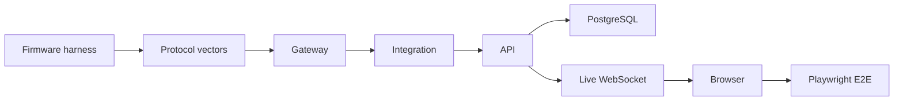

The integration tests use real processes:

-   real API
-   real gateway
-   real WebSocket
-   simulator/replay source

rather than mocking the entire transport layer.

------------------------------------------------------------------------

# ♿ Accessibility

The web E2E suite includes axe checks for WCAG 2 A/AA.

The UI also includes:

-   keyboard controls
-   reduced-motion support
-   responsive layout
-   mobile navigation
-   explicit status states
-   accessible dialogs/tabs/tooltips

The recorded result is:

> **Zero serious/critical axe violations on the tested key pages and
> themes.**

------------------------------------------------------------------------

# 📈 Performance

Load tests were performed on:

``` text
2 vCPU x86_64
Linux
Python 3.13
PostgreSQL 16
single API worker
load generator on same machine
synthetic data
```

### Maximum ingest

One device pushed 60 seconds of data as fast as accepted:

> **15,436 frames in 2.42 s → \~6,400 frames/s**

with zero lost frames.

### Real-time device simulation

    Devices Result                                      p50 ingest      Worst p95
  --------- ----------------------------------------- ------------ --------------
          8 all frames accounted for                       31.9 ms   **176.5 ms**
         16 all frames accounted for                       41.3 ms     **336 ms**
         32 all frames accounted for, but saturated          5.6 s     **14.8 s**

### Interpretation

On this 2-vCPU machine:

> **\~16 simulated devices can run in real time with sub-second p95
> ingest latency.**

At 32 devices, the single API process saturates.

The measured bottleneck is primarily:

``` text
single-threaded Python DSP
        +
per-second PostgreSQL inserts
```

The repository documents scale-out options rather than hiding the
saturation point.

------------------------------------------------------------------------

# 🔐 Security & Privacy

Physiological recordings become sensitive health data when they
correspond to real people.

The platform therefore treats these as security assets:

``` text
physiological recordings
device ingest keys
user credentials
JWT secret
audit trail
```

## Controls

-   bcrypt password hashing
-   IP + email sliding-window rate limiting
-   short-lived HS256 JWTs
-   sessionStorage instead of localStorage for JWT
-   WebSocket token sent in a message, not URL
-   random 256-bit per-device ingest keys
-   device keys stored as SHA-256 hashes
-   server-side RBAC
-   strict frame parsing
-   CRC validation
-   Pydantic validation
-   upload size limits
-   generic 500 responses
-   security headers
-   CSP in nginx
-   audit log
-   bounded live queues
-   explicit synthetic-data propagation

### Privacy model

The platform does not require names, dates of birth, or other identity
fields.

Raw samples are retained for a configurable period and device deletion
cascades through sessions, samples, vitals, and events.

------------------------------------------------------------------------

# ⚠️ Security gaps --- intentionally documented

The current prototype does **not** claim to solve everything.

Known gaps include:

-   TLS termination is expected at a reverse proxy
-   no refresh-token / server-side token revocation system
-   in-process rate limiting
-   application-level encryption-at-rest is not provided
-   BLE currently uses an open Nordic UART Service without bonding
-   automated dependency scanning beyond CI builds is not implemented

These are documented in the threat model and deployment checklist.

------------------------------------------------------------------------

# 🛰️ Real Hardware

The software path can be connected to the physical device.

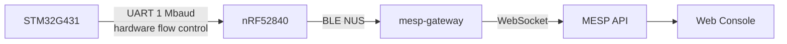

### Gateway

``` bash
mesp-gateway \
  --source ble \
  --ble-name MESP-Health \
  --api ws://<api-host>:8000/api/v1/ingest/ws \
  --record session.mesprec
```

Without the BLE bridge:

``` bash
mesp-gateway \
  --source serial \
  --port /dev/ttyUSB0 \
  --baud 1000000
```

Recordings can later be replayed:

``` bash
mesp-gateway \
  --source replay \
  --file session.mesprec
```

The complete hardware setup is documented in
[`docs/deployment/README.md`](docs/deployment/README.md).

------------------------------------------------------------------------

# 🚀 Quick Start

## Local development

Requirements:

-   Python ≥ 3.11
-   Node.js / npm
-   PostgreSQL for full deployment, or SQLite for demo development

``` bash
make install
```

Start the API:

``` bash
make dev-api
```

Start the web console:

``` bash
make dev-web
```

Open:

``` text
http://localhost:5173
```

Then choose:

> **Explore the demo**

------------------------------------------------------------------------

## Docker

``` bash
cp .env.example .env
```

Set:

``` env
POSTGRES_PASSWORD=<strong-password>
MESP_JWT_SECRET=<strong-secret>
MESP_ADMIN_EMAIL=<admin-email>
MESP_ADMIN_PASSWORD=<strong-password>
```

Then:

``` bash
docker compose up --build -d
```

Open:

``` text
http://localhost:8080
```

------------------------------------------------------------------------

# ☁️ Deployment Architecture

The platform supports a split deployment model:

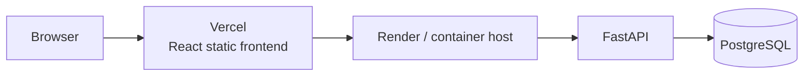

The API needs long-lived WebSocket connections, a background demo
simulator, and PostgreSQL, so it belongs on a container host rather than
a purely serverless frontend platform.

The repository includes configuration for Vercel + Render.

**Important:** the project documentation explicitly states that no
public deployment was made by the author, so the repository does not
claim uptime or production-scale hosted performance.

------------------------------------------------------------------------

# 🗂️ Repository

``` text
Mesp_platform/
│
├── apps/
│   ├── api/                  # FastAPI ingest + DSP + events + REST + WS
│   └── web/                  # React/TypeScript monitoring console
│
├── services/
│   └── gateway/              # BLE / serial / replay / simulator gateway
│
├── packages/
│   ├── protocol/             # Python + TS wire protocol
│   ├── types/                # shared TypeScript types
│   └── ui/                   # design system
│
├── simulator/                # byte-exact device simulator
├── replay/                   # .mesprec record/replay
├── firmware-harness/         # host build of firmware framing code
├── database/                 # Alembic migrations
├── docker/                   # Docker + nginx
│
├── tests/
│   ├── integration/
│   └── load/
│
└── docs/
    ├── architecture/
    ├── protocol/
    ├── security/
    ├── deployment/
    ├── testing/
    ├── decisions/
    └── REPORT.md
```

------------------------------------------------------------------------

# 🧰 Developer Commands

``` bash
# Install
make install

# Lint
make lint

# Full Python/API/integration tests
make test-py

# Frontend tests
make test-web

# Full test target
make test

# Browser E2E
make e2e

# Development API
make dev-api

# Development web
make dev-web

# Docker deployment
make up

# Load test
make load
```

------------------------------------------------------------------------

# 📚 Documentation

  ------------------------------------------------------------------------------------------------------------------
  Topic                               Documentation
  ----------------------------------- ------------------------------------------------------------------------------
  System architecture                 [`docs/architecture/overview.md`](docs/architecture/overview.md)

  Timestamp reconstruction            [`docs/architecture/timestamps.md`](docs/architecture/timestamps.md)

  Link protocol v1                    [`docs/protocol/link-protocol-v1.md`](docs/protocol/link-protocol-v1.md)

  Ingest protocol                     [`docs/protocol/ingest-protocol-v1.md`](docs/protocol/ingest-protocol-v1.md)

  Live WebSocket                      [`docs/protocol/live-websocket-v1.md`](docs/protocol/live-websocket-v1.md)

  REST API                            [`docs/api/README.md`](docs/api/README.md)

  Security threat model               [`docs/security/threat-model.md`](docs/security/threat-model.md)

  Deployment                          [`docs/deployment/README.md`](docs/deployment/README.md)

  Testing                             [`docs/testing/README.md`](docs/testing/README.md)

  Load results                        [`docs/testing/load-results.md`](docs/testing/load-results.md)

  Technical report                    [`docs/REPORT.md`](docs/REPORT.md)

  Architecture decisions              [`docs/decisions/`](docs/decisions/)

  Security policy                     [`SECURITY.md`](SECURITY.md)
  ------------------------------------------------------------------------------------------------------------------

------------------------------------------------------------------------

# 🧠 Engineering Decisions Worth Reading

The project includes explicit ADRs for the decisions that shape the
architecture:

  ADR       Decision
  --------- -----------------------------
  ADR-001   Monorepo structure
  ADR-002   Gateway forwards raw frames
  ADR-003   In-process live hub
  ADR-004   PostgreSQL storage strategy
  ADR-005   Timestamp reconstruction
  ADR-006   Canvas waveform rendering
  ADR-007   Demo mode
  ADR-008   Authentication

These decisions explain **why** the system is shaped this way, not just
what technologies were selected.

------------------------------------------------------------------------

# 📋 Verified vs. Not Yet Proven

  -----------------------------------------------------------------------
  Verified                            Not yet measured / implemented
  ----------------------------------- -----------------------------------
  Firmware framing vectors match      Clinical HR accuracy
  byte-for-byte                       

  Python + TypeScript protocol        Clinical SpO₂ accuracy
  conformance                         

  122 automated tests                 Fall sensitivity/specificity

  Exact injected-loss accounting      BLE range

  Real-process gateway ↔ API          BLE-air end-to-end latency
  integration                         

  \~6,400 frames/s max ingest on test Hardware throughput under real RF
  machine                             conditions

  16 simulated devices in real time,  Battery gauge
  p95 ≤336 ms                         

  WCAG 2 A/AA automated checks        Skin-temperature sensor

  Docker/CI configuration and smoke   Public hosted uptime
  tests                               

  Synthetic-data provenance through   Production multi-replica live hub
  exports                             
  -----------------------------------------------------------------------

This distinction is intentional.

**The README reports what the repository demonstrates, not what would
make the project sound impressive.**

------------------------------------------------------------------------

# 🎯 What this project demonstrates

**Embedded Systems**

STM32 · ADC · DMA · UART · BLE · sensor protocols · device profiles

**Backend / Distributed-ish Systems**

async ingestion · WebSockets · backpressure · reconnect logic ·
persistence · replay · observability

**Signal Processing**

ECG filtering · R-peak detection · RR analysis · PPG pulse extraction ·
ratio-of-ratios · motion gating · IMU processing

**Frontend Engineering**

React · TypeScript · canvas rendering · ring buffers · real-time
visualization · responsive UX · accessibility

**Data Engineering**

timestamp reconstruction · loss accounting · chunked storage · retention
· historical envelopes · provenance

**Security**

JWT · RBAC · device credentials · rate limiting · audit logging · CSP ·
input validation

**Testing**

firmware conformance · property-style scenario tests · real-process
integration · PostgreSQL tests · Playwright · axe · load testing

------------------------------------------------------------------------

# 🚧 Scope & limitations

MESP is a **research/engineering prototype**.

It is not:

-   a medical device
-   clinically validated
-   a diagnostic system
-   a replacement for a pulse oximeter / ECG monitor
-   a certified patient-monitoring platform
-   a claim of BLE performance in real-world RF conditions
-   a production cloud service

The project deliberately labels synthetic data and explicitly documents
unmeasured clinical and hardware characteristics.

------------------------------------------------------------------------

::: {align="center"}
## From a sensor pin to a browser pixel.

### MESP turns a fragile stream of wearable bytes into a testable, observable, replayable real-time monitoring system.

`<br>`{=html}

**Built around one principle:**

> **If the system cannot explain where a number came from, when it was
> measured, whether data was lost, and whether it is synthetic, it
> should not pretend the number is trustworthy.**
:::
