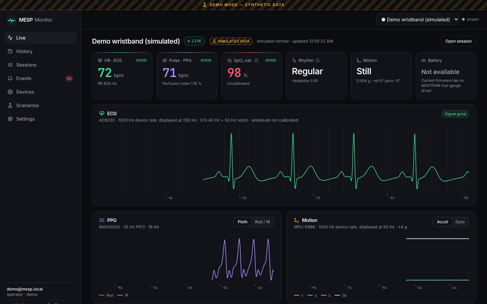
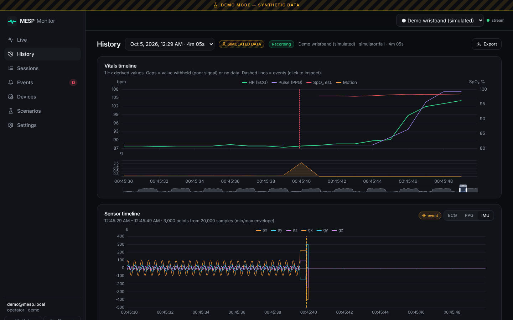
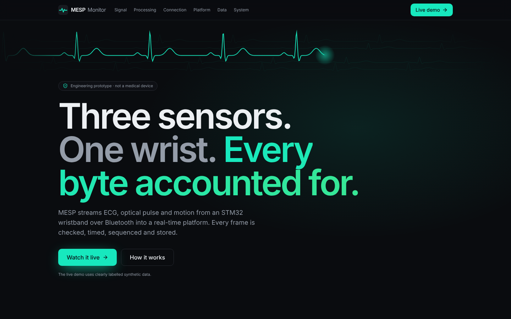

# MESP Health Monitoring Platform

**Wrist-worn multi-parameter digital health monitor with BLE connectivity: firmware link → gateway → ingest pipeline → real-time console.**

> This system is an engineering/research prototype for physiological monitoring and visualization. It is not a medical device and does not provide a medical diagnosis. Measurements and alerts should not be used as a substitute for professional medical evaluation.



The MESP wristband (STM32G431 + AD8232 ECG + MAX30102 PPG + MPU-6886 IMU, nRF52840 BLE bridge) streams raw sensor batches in a small framed protocol. This repository is everything after the firmware:

- **`packages/protocol`**: the link protocol, *read from the firmware source* and verified byte-for-byte against frames produced by the firmware's own `nrf_link.c` compiled on a host (`firmware-harness/`). Python and TypeScript.
- **`services/gateway`**: BLE (Nordic UART Service), USB-serial, replay and simulator sources → deframer with resync → link state machine → WebSocket uplink with backoff.
- **`apps/api`**: FastAPI ingest pipeline (CRC re-check, sequence and duplicate tracking, timestamp reconstruction, 1 s chunk storage in PostgreSQL), signal processing, event rules, REST + live WebSocket, auth, audit, export.
- **`apps/web`**: React + TypeScript console with canvas waveforms, history, events, devices, scenarios; plus a landing page.
- **`simulator` / `replay`**: a device simulator that emits byte-exact firmware frames (10 deterministic scenarios), and raw byte-stream recordings. **Hardware, recordings and the simulator share one code path.**

## Quick start

```bash
make install         # pip -e packages + npm ci
make dev-api         # API on :8000 (SQLite, demo mode)
make dev-web         # console on :5173 → "Explore the demo"
```

or with Docker (PostgreSQL):

```bash
cp .env.example .env     # set secrets
docker compose up --build -d   # → http://localhost:8080
```

Real hardware: [docs/deployment](docs/deployment/README.md#3-real-hardware).

## What it does

| | |
|---|---|
| **Live** | ECG (250 Hz display from 1 kHz), PPG pleth or raw red/IR, accel/gyro + magnitude. Ring buffers + `requestAnimationFrame`, min/max decimation, gaps drawn as breaks, pause, zoom, pan, fullscreen, keyboard control. Six explicit states: LIVE, STALE, DISCONNECTED, LOADING, ERROR, NO DATA. |
| **Derived values** | HR from ECG R-peaks, RR, beat-interval irregularity, ECG quality and lead-off; pulse rate, perfusion index and an *uncalibrated* SpO₂ estimate from PPG (withheld under motion); activity, orientation, IMU die temperature; heuristic fall detection. |
| **Events** | INFO / WARNING / CRITICAL, sustained-condition rules with hysteresis (HR, SpO₂ estimate, lead-off, signal quality, irregular RR pattern, battery, packet loss, CRC errors) plus falls and link events. Acknowledge with a note; click through to the exact second on the sensor timeline. |
| **Link** | Frames OK, lost (from the 8-bit sequence counter), CRC errors, duplicates, timestamp gaps, ingest latency p50/p95. |
| **History** | Zoomable vitals timeline with event markers; raw sensor timeline over min/max envelopes; session analytics (ECG vs PPG HR agreement, SpO₂ distribution, activity and quality breakdown); CSV/JSON export. |
| **Demo** | 10 scenarios: normal, exercise, poor ECG contact, low SpO₂, fall, irregular rhythm, BLE disconnect, low battery, packet corruption, packet loss. Labelled **DEMO MODE — SYNTHETIC DATA** everywhere. |

<p>


</p>

## Honest status

| Verified in this repository | Not yet measured / not implemented |
|---|---|
| Decoders match the firmware's own framing code byte for byte (9 vectors, Python + TS) | Accuracy of HR, SpO₂ or rhythm flags against a reference device |
| 122 automated tests across protocol, simulator, replay, gateway, API (SQLite and PostgreSQL), integration, web unit and E2E (incl. axe WCAG 2 AA) | Fall-detection sensitivity/specificity |
| Injected packet loss = loss counted from sequence gaps, exactly | BLE range, throughput and packet loss on the hardware |
| One API process (2 vCPU) ingests ~6 400 frames/s; 16 simulated devices in real time with p95 ingest latency ≤ 336 ms ([load results](docs/testing/load-results.md)) | End-to-end latency including the radio |
| | Battery gauge, skin temperature, display: **not in the current firmware** (shown as *Not available*; a proposed status line is documented) |
| | Docker images were not built in the authoring sandbox (registry blocked); CI builds and smoke-tests them |

## Repository layout

```
apps/web               React console + landing page
apps/api               FastAPI service (mesp_api)
services/gateway       edge gateway (mesp_gateway, CLI: mesp-gateway)
packages/protocol      link protocol v1: python/, ts/, vectors/
packages/types         shared TS types (API + live WS)
packages/ui            design tokens
simulator              byte-exact device simulator (CLI: mesp-sim)
replay                 .mesprec recordings + replay engine
firmware-harness       host build of the firmware's nrf_link.c → golden vectors
database               Alembic migrations
docker                 Dockerfiles, nginx
tests/integration      real processes over real WebSockets
tests/load             ingest load generator
docs/                  architecture, protocol, api, security, deployment, testing, decisions (ADRs), report
```

## Documentation

- [Architecture](docs/architecture/overview.md) · [Timestamps](docs/architecture/timestamps.md)
- Protocols: [link v1](docs/protocol/link-protocol-v1.md) · [ingest v1](docs/protocol/ingest-protocol-v1.md) · [live WebSocket v1](docs/protocol/live-websocket-v1.md) · [proposed status lines](docs/protocol/status-lines.md)
- [REST API](docs/api/README.md) ([OpenAPI](docs/api/openapi.json))
- [Security & privacy](docs/security/threat-model.md) · [Deployment](docs/deployment/README.md) · [Testing](docs/testing/README.md)
- Decisions: [ADR-001 … ADR-008](docs/decisions/)
- [Technical report](docs/REPORT.md)

## License

MIT. See [LICENSE](LICENSE). `firmware-harness/vendor/` contains files copied from the MESP_lab firmware.
