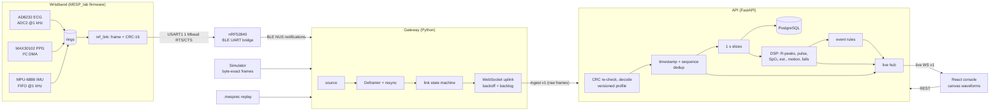

# Architecture

## Components

| Path | Role | Key decisions |
|---|---|---|
| `firmware-harness/` | compiles the firmware's `nrf_link.c` on a host, emits golden frames | protocol is *read from the firmware*, not assumed |
| `packages/protocol` | link protocol v1: CRC, deframer, decoders, device profiles (Python + TypeScript) | same vectors test both languages |
| `simulator/` | 10 deterministic scenarios → firmware-format bytes | ADR-007 |
| `replay/` | `.mesprec` raw byte recordings, timing-faithful playback | |
| `services/gateway` | BLE / serial / sim / replay → frames → API | ADR-002 |
| `apps/api` | ingest pipeline, storage, DSP, events, REST, live WS, auth | ADR-003/004/005 |
| `apps/web` | landing page + monitoring console | ADR-006 |
| `database/` | Alembic migrations | |

## One path for every source

Hardware (BLE/serial), recordings and the simulator all produce a **byte stream**. Each goes through the same `Deframer`, the same `Gateway` link state machine, the same ingest message format and the same `IngestSession`. The only difference is the `synthetic` and `realtime` flags in `hello`, which drive labelling and whether latency is measured. In demo mode the API runs the gateway in-process (`demo.py`), calling the same `IngestSession.handle_batch` the WebSocket endpoint calls.

## Ingest pipeline (per gateway connection)

1. **Validate**: `parse_frame` re-checks magic, length and CRC (the gateway already did; the server doesn't trust it).
2. **Sequence**: 8-bit counter. Gap = lost frames (a lower bound across long outages, because whole 256-frame wraps are invisible). Same `(seq, crc)` within the last 16 = duplicate, dropped.
3. **Decode** with the device profile.
4. **Timestamp** each sample (see [timestamps.md](timestamps.md)).
5. **Live**: display-filtered, decimated samples go to the hub immediately (per 50 ms batch).
6. **Slice**: every complete second of device time is persisted (one chunk per stream) and analysed.
7. **Derive**: ECG R-peaks → HR/RR/irregularity/quality/lead-off; PPG → pulse rate, perfusion index, SpO₂ estimate; IMU → activity, orientation, die temperature, fall heuristic.
8. **Events**: sustained-condition rules with hysteresis, plus instantaneous falls and link events.
9. **Publish** vitals and events.

## Failure handling

| Failure | Detected by | Effect |
|---|---|---|
| bit errors on the link | CRC (gateway and API) | frame dropped, `crc_errors`, `crc_errors` event above 1 % / 10 s |
| lost frames | sequence gaps | `lost_frames`, `packet_loss` event above 2 % / 10 s |
| BLE disconnect | gateway source / link state machine | `device_disconnected` / `device_reconnected` with outage duration, timestamp gap, waveform break |
| data stalls with link up | gateway stale timer (2 s) | `stale` state, console shows STALE |
| gateway ↔ API outage | uplink | reconnect with backoff; bounded drop-oldest backlog (2 000 messages) |
| API restart mid-session | WebSocket close | session ended; gateway reconnects into a new session |
| slow browser | per-client bounded queue | oldest messages dropped for that client only |
| gateway crash | WebSocket close without `bye` | `device_disconnected` event |
